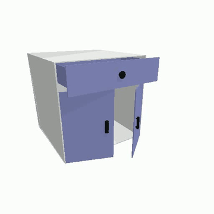

# PhysX 논문 재현 프로젝트 (2026)

*새로운 방법을 개발하는 것이 아니라, 공개된 PhysX 계열 논문들의 코드를 그대로 재현해*
*"논문이 주장한 결과가 실제로 나오는가"를 검증하는 국가 R&D 과제(제1세부 과제) 기록입니다.*

  

  URDFormer(RSS 2024) 재현 결과 — 사진 한 장에서 예측한 서랍·문 관절 구조를 PyBullet으로 렌더링

  
  
  

"VLM & Physics-aware 생성형 시뮬레이션 환경 구축을 통한 제조 현장 이상탐지·대응 기술 개발" 과제의 일환으로,
아래 4개 논문을 순서대로 재현하고 있습니다.

| 논문 | 상태 |
|---|---|
| [1. PhysGaussian](#1-physgaussian) (CVPR 2024) | 재현 완료 — 연구원A·연구원B 교차검증까지 완료 |
| [2. Spring-Gaus](#2-spring-gaus) (ECCV 2024) | 재현 완료 — torus·burger, 결과비교·원인분석 |
| [3. URDFormer](#3-urdformer) (RSS 2024) | 부분 재현(Partial Reproduction) — Object-Level 300장 + Kitchen 54씬 정량 검증 |
| [4. PhysX-3D](#4-physx-3d-착수-예정) (NeurIPS 2025) | 착수 예정 |

**바로가기**: [논문·코드 출처](#재현-논문-출처-paper--code-references) ·
[폴더 구조](#폴더-구조-논문별) · [커밋 기록](#커밋-기록이-실제-진행-순서와-일치합니다) ·
[참여자](#참여자)

---

## 재현 논문 출처 (Paper & Code References)

> 각 항목의 arXiv 제목/저자는 arXiv 원문 페이지를 직접 확인(fetch)해 검증했습니다. GitHub commit hash는
> 실제 재현 작업 시점에 `git rev-parse HEAD`로 기록된 값입니다. "겪은 문제와 해결 과정"(연구노트)은
> 각 논문 폴더의 `환경구축_컴파일이슈해결/` 문서에 상세히 있고, 아래는 정확한 출처 인용만 정리합니다.

### 1. PhysGaussian
- **Title**: *PhysGaussian: Physics-Integrated 3D Gaussians for Generative Dynamics*
- **Authors**: Tianyi Xie, Zeshun Zong, Yuxing Qiu, Xuan Li, Yutao Feng, Yin Yang, Chenfanfu Jiang
- **Venue**: CVPR 2024 (arXiv 페이지의 "Comments" 필드: "Accepted by CVPR 2024" 직접 확인. **"Highlight"
  등급 여부는 공식 GitHub README와 arXiv 양쪽 다 확인되지 않아 표기하지 않음** — 이전 버전에 있던
  "(Highlight)" 표기는 근거를 찾지 못해 삭제함)
- **Paper**: [arXiv:2311.12198](https://arxiv.org/abs/2311.12198)
- **Official Code**: [github.com/XPandora/PhysGaussian](https://github.com/XPandora/PhysGaussian) — 사용 commit
  `8339ed6aa2cd5d50e1001a254a3d95aea678a956`(로컬 clone `git remote -v`/`git rev-parse HEAD`로 직접
  재확인)
  (내부 submodule: `gaussian-splatting` `d9fad7b3450bf4bd29316315032d57157e23a515`, 그 하위
  `SIBR_viewers` `4ae964a267cd7a844d9766563cf9d0b500131a22`,
  `diff-gaussian-rasterization` `59f5f77e3ddbac3ed9db93ec2cfe99ed6c5d121d`,
  `simple-knn` `44f764299fa305faf6ec5ebd99939e0508331503` — 전부 `git submodule status --recursive`로
  직접 재확인)
- **문제/해결 과정(연구노트)**: `01_PhysGaussian/환경구축_컴파일이슈해결/`, `01_PhysGaussian/연구원A_결과.md`

### 2. Spring-Gaus
- **Title**: *Reconstruction and Simulation of Elastic Objects with Spring-Mass 3D Gaussians*
- **Authors**: Licheng Zhong, Hong-Xing Yu, Jiajun Wu, Yunzhu Li
- **Venue**: ECCV 2024 — 공식 GitHub 저장소 README 제목 아래 "ECCV 2024" 표기 및 BibTeX 인용 블록의
  `journal = {European Conference on Computer Vision (ECCV)}` 문구로 직접 재확인(이전 버전에서 "arXiv
  페이지에 venue 표기 없음"이라 재검증 필요라고 남겼던 부분 — 공식 GitHub README를 추가로 확인해 해소함)
- **Paper**: [arXiv:2403.09434](https://arxiv.org/abs/2403.09434)
- **Official Code**: [github.com/Colmar-zlicheng/Spring-Gaus](https://github.com/Colmar-zlicheng/Spring-Gaus) — 사용 commit
  `62a1bb5dbe83fe4396efa7048d3226754ac8fe1d`(로컬 clone `git remote -v`/`git rev-parse HEAD`로 직접
  재확인)
  (내부 submodule `diff-gaussian-rasterization` `59f5f77e3ddbac3ed9db93ec2cfe99ed6c5d121d`,
  `simple-knn` `44f764299fa305faf6ec5ebd99939e0508331503` — `git submodule status`로 직접 재확인)
- **문제/해결 과정(연구노트)**: `02_SpringGaus/환경구축_컴파일이슈해결/`, `02_SpringGaus/연구원A_결과.md`

### 3. URDFormer
- **Title**: *URDFormer: A Pipeline for Constructing Articulated Simulation Environments from Real-World Images*
- **Authors**: Zoey Chen, Aaron Walsman, Marius Memmel, Kaichun Mo, Alex Fang, Karthikeya Vemuri, Alan Wu,
  Dieter Fox, Abhishek Gupta
- **Venue**: RSS(Robotics: Science and Systems) 2024 — arXiv 페이지 Comments 필드 "Accepted at RSS2024"로
  직접 재확인
- **Paper**: [arXiv:2405.11656](https://arxiv.org/abs/2405.11656) · [프로젝트 페이지](https://urdformer.github.io/)
- **Official Code**: [github.com/WEIRDLabUW/urdformer](https://github.com/WEIRDLabUW/urdformer) — 사용 commit
  `ee0e77ca0e08483fd63890673c47e4a3bd68fa91`(로컬 clone `git remote -v`/`git rev-parse HEAD`로 직접
  재확인)
- **문제/해결 과정(연구노트) 및 최종 재현 판정(Partial Reproduction)**:
  `03_URDFormer/환경구축_컴파일이슈해결/실행결과_보고.md`

### 4. PhysX-3D (착수 예정)
- **Title**: *PhysX-3D: Physical-Grounded 3D Asset Generation*
- **Authors**: Ziang Cao, Zhaoxi Chen, Liang Pan, Ziwei Liu
- **Venue**: NeurIPS 2025 (Spotlight) — arXiv 페이지 Comments 필드 "Accepted by NeurIPS 2025, Spotlight"로
  직접 확인
- **Paper**: [arXiv:2507.12465](https://arxiv.org/abs/2507.12465) · [프로젝트 페이지](https://physx-3d.github.io/)
- **Official Code**: 미확인 — 재현 작업 자체가 아직 시작 전이라 사용할 commit도 미정. 계획 메모만
  로컬에 존재(**이 저장소 밖의 별도 폴더에 있어 이 GitHub 저장소에는 포함되어 있지 않음** — 착수 시점에
  이 저장소 안으로 옮겨 커밋할 예정)

## 폴더 구조 (논문별)

- **`00_연구준비/`** — 10편 논문 전체 공통 조사자료(특정 논문 한정 아님)
- **`01_PhysGaussian/`** — 1순위 논문. 환경구축·컴파일 이슈 해결 → 연구원A/연구원B 각자 결과 → 교차검증
- **`02_SpringGaus/`** — 2순위 논문. 환경구축·컴파일 이슈 해결 → 연구원A/연구원B 각자 결과 → 결과비교 및 원인분석
- **`03_URDFormer/`** — 3순위 논문(교수님 지시로 착수). 환경구축·재현 완료 — 패키지 버전 이슈 6건
  + 소스 코드 최소 패치 3건 해결, README 기본 예제(캐비닛류)로 전체 파이프라인 성공 확인. 다음은
  논문 범주 밖인 노트북 힌지·로봇팔로 시도 예정.
- 다음은 PhysX-3D(2025, 교수님 지시로 재현 범위에 신규 편입 — 당초 2024년 말까지로 범위를 잡으며 빠졌던
  논문). RTX 5090(32GB)/Linux 환경에서 진행 예정.

각 논문 폴더 안 구성:
- `환경구축_컴파일이슈해결/` — 겪은 문제와 해결 과정(실제 코드 패치 포함)
- `결과영상/`, `샘플이미지/` — 재현 결과물
- `연구원A_결과.md`, `연구원B_결과.md` — 담당자별 결과 보고
- `결과비교.md` / `결과비교_및_원인분석.md` — 두 사람 결과 종합 비교

## 커밋 기록이 실제 진행 순서와 일치합니다

하드웨어 조사 → PhysGaussian 환경구축/결과 → Spring-Gaus 환경구축/결과 → 각자 결과 요약 →
팀원 간 교차검증·원인 분석 순으로 커밋이 쌓여 있습니다. Commits 탭에서 진행 과정을 그대로 확인하실 수 있습니다.

## 참여자

- **연구원A**: PhysGaussian·Spring-Gaus(torus·burger) 전체 재현 완료
- **연구원B**: PhysGaussian 재현 완료(교차검증), Spring-Gaus torus 재현 성공(7회 중 3회, 원인은 비결정성으로 잠정 결론), burger는 아직 시도 전

---

(2026-09-17) 교수님 확인·지시에 따라 비공개(Private)에서 공개(Public)로 전환 완료했습니다. 저장소
내 실명은 팀원 보호를 위해 익명 라벨(연구원A/연구원B)로 대체했습니다.
